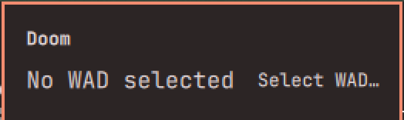

# Doom — an Omarchy bar plugin



Play Doom straight from the Omarchy bar: click the skull icon, pick a WAD,
and go. There's no bundled WAD (id Software's IWADs are commercial — bring
your own), so the panel always asks for one first.

## What it does

- Adds a bar-widget icon (`☠`, `⏸` while a game is paused/hidden — see
  below) that left-click opens as a small floating panel while no game is
  running.
- The panel walks through: is `chocolate-doom` installed → do you have a
  WAD selected → pick a resolution (`800x600` to `1920x1080`) → play.
- **Play** launches `chocolate-doom` as a plain, independent, floating
  window (not fullscreen, not tiled — see [Design notes](#design-notes)
  below) and closes the panel so the game gets real keyboard focus.
- Once a game is running, **left-clicking the bar icon again pauses it and
  hides its window** (parked on a hidden Hyprland special workspace, and
  the icon switches to `⏸`); clicking once more resumes and reveals it
  exactly where it was. This is a plain click-to-toggle, not automatic
  pause-on-focus-loss (see [Design notes](#design-notes) for why that
  didn't work out).
- **Right-click the bar icon** any time to reach the panel itself (e.g. to
  **Quit** the running game or **Change WAD**) — left click is claimed by
  the pause/hide toggle once a game is running.

## Requirements

- [`chocolate-doom`](https://aur.archlinux.org/packages/chocolate-doom) —
  AUR-only on Arch (`yay -S chocolate-doom` / `paru -S chocolate-doom`).
  The panel detects if it's missing and offers a one-click terminal with
  that command pre-filled; it never runs an installer on your behalf
  silently. (`doomretro`, in the official `extra` repo, was tried first
  since it needs no AUR helper, but it doesn't reliably exit on `SIGTERM`
  once its window is mapped and needs its own config file patched to avoid
  launching fullscreen — chocolate-doom does neither: a plain `-window`
  flag forces windowed mode and it quits cleanly on `SIGTERM`, both
  confirmed in testing.)
- `zenity` for the WAD file picker (ships by default on most Omarchy
  installs).
- A WAD file you legally own — shareware `doom1.wad`, a retail `DOOM.WAD`/
  `DOOM2.WAD`, or any PWAD you want to load as the IWAD.

## Installing

```bash
omarchy plugin add https://github.com/bogard1/omarchy-doom-plugin.git --enable
```

Or by hand:

```bash
git clone https://github.com/bogard1/omarchy-doom-plugin.git \
  ~/.config/omarchy/plugins/io.github.bogard1.doom
omarchy-shell shell rescanPlugins
omarchy plugin enable io.github.bogard1.doom
```

## Uninstalling

```bash
omarchy plugin remove io.github.bogard1.doom
```

This removes the plugin directory and disables the bar icon. It doesn't
touch anything else — no window rules or config files are added anywhere
outside the plugin's own directory, so there's nothing else to clean up.
`chocolate-doom` itself, and any WAD files you picked, are untouched;
remove those yourself (`sudo pacman -R chocolate-doom`) if you don't want
them either.

## Design notes

This intentionally does the minimum: launch the game and get out of its
way, rather than managing its window. Two earlier, more ambitious designs
were tried and dropped during testing:

**Pixel-aligning the game into the panel's box.** Wayland/Hyprland don't
support compositing a live *texture* of another process's window into a
QML item while also forwarding mouse/keyboard input to it — the capture
protocols (`wlr-screencopy`, `hyprland-toplevel-export-v1`) are read-only,
and Wayland's virtual-input protocols always target whatever surface
currently holds compositor focus. The fallback — running the game as a
real window and using Hyprland's `windowrulev2` + `movewindowpixel` /
`resizewindowpixel` / `focuswindow` dispatchers to snap it onto the
panel's box — is the standard approach and works on most current
Hyprland installs, but not on this project's dev machine: it runs
Hyprland 0.56's Lua-config branch, which replaced the classic
string-based dispatcher protocol with a structured Lua API
(`hl.dsp.window.*`). Neither `hyprctl dispatch <request>` nor Quickshell's
`Hyprland.dispatch()` QML binding (which sends that same legacy string)
work against it — confirmed by writing directly to Hyprland's IPC socket
and getting back `hl.dispatch: expected a dispatcher`.

Exact panel-box alignment was dropped (there's no arbitrary-pixel-position
dispatcher in this API, only workspace moves, resize, and center — see
below), but this branch's own dispatch API turned out to cover floating,
sizing, and centering just fine, all driven from `bin/*.sh`
via `hyprctl eval "hl.dispatch(hl.dsp.window.<action>(...))"`
(`hl.dispatch(...)` actually *calls* a dispatcher; `hl.dsp.window.x(...)`
alone just *constructs* one to bind to a key, the only form any example
in Omarchy's own bindings uses, which cost some time to untangle):

- `hl.dsp.window.float({ action = "toggle" })` — the equivalent of
  `hyprctl dispatch setfloating`.
- `hl.dsp.window.resize({ x = W, y = H })` — **absolute** width/height,
  keyed confusingly as `x`/`y`. Add `relative = true` (the only form
  shown in Omarchy's bindings) and they become deltas instead.
- `hl.dsp.window.center()` — the equivalent of `hyprctl dispatch
  centerwindow`, no arguments.
- `hl.dsp.window.move({ workspace = "special:doom" })` +
  `hl.dsp.workspace.toggle_special("doom")` — parks the window on a
  hidden scratchpad-style workspace and reveals/hides it on demand; this
  is what drives the bar icon's pause/hide-resume/show toggle (`bin/
  toggle-doom.sh`; see the "What it does" section above).

`bin/float-doom.sh` (float + resize + center, run once right after
launch) gets away with operating on whatever window currently has
focus, confirmed beforehand by polling `hyprctl activewindow` — right
after launch, that's reliably the game. `bin/toggle-doom.sh`'s hide step
can't make that assumption: it runs whenever the bar icon is clicked,
which could be long after launch, and by then whatever the player looked
at last (a terminal, a browser) is the focused window, not the game — an
early version of this script hid *that* instead, moving the wrong window
into the special workspace. The fix, and proof that this API *does*
support address-targeting despite no example anywhere showing it:
`hl.get_windows({ class = "chocolate-doom" })` returns matching window
objects regardless of focus, and passing one as the `window` field on a
dispatcher's argument table (e.g. `hl.dsp.window.move({ workspace = ...,
window = w[1] })`) targets that window specifically. Confirmed by
hiding the game with an unrelated app focused in a different workspace
and checking nothing else moved. `toggle-doom.sh` logs every `hyprctl
eval` call and its output to `$XDG_STATE_HOME/io.github.bogard1.doom/
toggle.log`, timestamped, for diagnosing anything similar.

On classic (non-Lua) Hyprland all of the `hyprctl eval` calls above just
fail harmlessly and the window stays wherever it would otherwise have
ended up — no worse off than not having these scripts at all.

**Auto-pausing the game when the panel loses focus.** Tried via `SIGSTOP`
on blur / `SIGCONT` on refocus, using Hyprland's toplevel-tracking API to
tell "focus moved to the game we launched" (fine) apart from "focus moved
to something else" (pause). In testing this fought with the game window
for keyboard focus — chocolate-doom accepted no keyboard input at all
while the popup stayed open beside it, and once it did take focus (e.g.
via a mouse click into it), the popup's own click-outside dismissal or a
race in the focus-tracking logic would immediately `SIGSTOP` the game
that had just started, or leave it receiving no input at all. None of the
fixes attempted (suppressing the popup's dismissal while a game is
running, gating the focus watcher on a confirmed window match) resolved
it reliably enough to ship. What shipped instead is a plain click, not an
automatic one: left-clicking the bar icon while a game is running pauses
and hides it (via the special-workspace trick above); clicking again
resumes and reveals it. No focus-tracking, no race — it only ever runs
from an explicit click.

If you want to pick the pixel-alignment idea back up — e.g. once
Quickshell grows Lua-dispatch support for Hyprland 0.56+, or once this
API turns up an arbitrary-pixel-position dispatcher (address-targeting a
window for the operations that already exist, at least, is solved — see
the `hl.get_windows` note above) — the approach above is the place to
start from.

## Files

| File               | Purpose                                             |
|--------------------|------------------------------------------------------|
| `manifest.json`    | Plugin manifest (`bar-widget` kind)                  |
| `BarWidget.qml`    | Bar icon, opens/closes the panel                     |
| `Panel.qml`        | State machine: install check → pick WAD → play       |
| `bin/pick-wad.sh`  | `zenity --file-selection` wrapper for choosing a WAD |
| `bin/float-doom.sh` | Floats, resizes, and centers the game window post-launch |
| `bin/toggle-doom.sh` | Hides/reveals the running game via a Hyprland special workspace |

## License

MIT — see [LICENSE](LICENSE).
